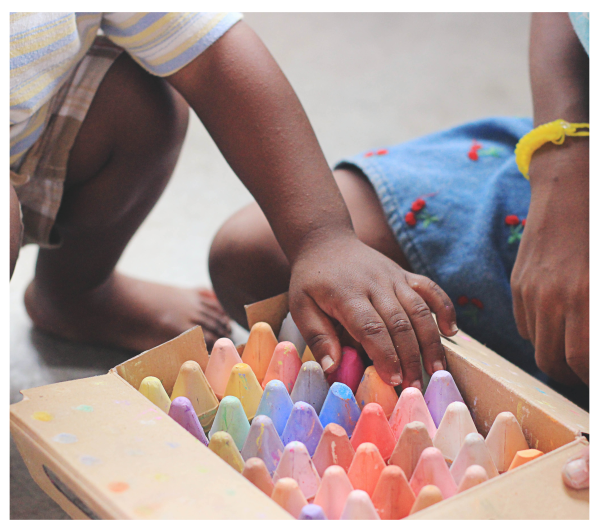

# Hackaplay
Hackaplay ainda é uma ideia, cujo objetivo principalm é auxiliar na evolução do raciocínio lógico de crianças das favelas, através da lógica de programação e ludicidade.

## 🎯Contexto
Em 2012, iniciei na área de tecnologia em São Paulo, enquanto vivia a atmosfera do local se ganha dinheiro com tecnologia passei a buscar resposta para a segunte pergunte: "Você existem poucas pessoas negras aqui?".
Em 2014 ingresso na Pontifícia Universidade Católica de Campinas, quando conheço um grande amigo Ike Banto que também tem em mente ideia de projeto semelhante, na área de tecnologia.

## 💻Tecnologias usadas

- Criatividade
- Google docs

## 📨 Entre em contato

